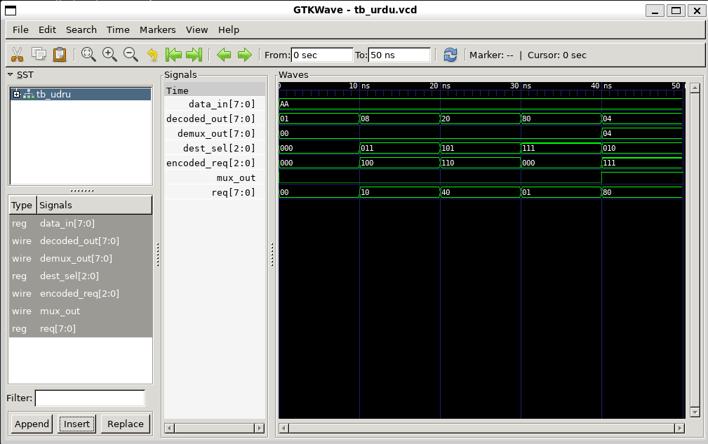

# Universal Data Router

A Verilog-based digital circuit implementation of a universal data router that manages multiple data requests and routes them to specified destinations using combinational logic.

## Project Overview

The Universal Data Router is a sophisticated digital system that combines several key components:

- **Priority Encoder**: Handles multiple simultaneous requests and assigns priority based on request line position
- **8:1 Multiplexer**: Selects one of eight input data lines based on the encoded priority
- **1:8 Demultiplexer**: Routes the selected data to one of eight output lines
- **3:8 Decoder**: Decodes a 3-bit destination selection signal to 8 individual output enable lines

## Architecture Diagram



## Module Specifications

### Main Module: `universal_data_router`

**Inputs:**
- `req[7:0]` - 8-bit request signal (one bit per requester)
- `data_in[7:0]` - 8-bit input data
- `dest_sel[2:0]` - 3-bit destination selection signal

**Outputs:**
- `encoded_req[2:0]` - 3-bit priority encoded request
- `mux_out` - Multiplexed output (selected data bit)
- `demux_out[7:0]` - Demultiplexed output (routed to selected line)
- `decoded_out[7:0]` - Decoded destination selection

### Sub-modules

#### Priority Encoder
```verilog
Priority_encoder enc (
    .req(req),           // 8-bit request input
    .out(encoded_req)    // 3-bit priority encoded output
);
```
- Prioritizes requests with MSB (request[7]) having highest priority
- Outputs 3-bit binary encoding of the highest priority request

#### 8:1 Multiplexer
```verilog
mux8to1 mux (
    .in(data_in),      // 8-bit data input
    .sel(encoded_req),  // 3-bit select signal
    .out(mux_wire)     // Selected output bit
);
```
- Selects one data bit from 8 inputs based on select signal

#### 1:8 Demultiplexer
```verilog
demux1to8 demux (
    .in(mux_wire),     // Single input bit
    .sel(dest_sel),    // 3-bit destination selector
    .out(demux_out)    // 8-bit output lines
);
```
- Routes single input bit to one of 8 output lines

#### 3:8 Decoder
```verilog
decoder3to8 dec (
    .in(dest_sel),     // 3-bit input
    .out(decoded_out)  // 8-bit decoded output
);
```
- Converts 3-bit destination selection to 8 one-hot encoded outputs

## Files

| File | Description |
|------|-------------|
| `universal_data_router.v` | Main design module and all sub-modules |
| `tb_urdu.v` | Testbench for simulation and verification |
| `tb_urdu.vcd` | Waveform dump file (VCD format) |
| `simv.out` | Simulation output log |
| `univeral.png` | Architecture diagram |
| `README.md` | This documentation file |

## Simulation & Testing

The project includes a comprehensive testbench (`tb_urdu.v`) that verifies all functionality:

### Running the Simulation

```bash
iverilog -o simv universal_data_router.v tb_urdu.v
./simv
```

### Viewing Waveforms

Open the generated VCD file with a waveform viewer:
```bash
gtkwave tb_urdu.vcd
```

## Design Characteristics

- **Combinational Logic**: All components use combinational circuits (no sequential logic)
- **Priority-Based Routing**: Automatically prioritizes requests when multiple are active
- **Time Scale**: 1ns / 1ps precision for accurate simulation timing
- **Bus Width**: 8-bit data bus with 3-bit control signals
- **Modularity**: Hierarchical design with reusable sub-modules

## Use Cases

- Multi-source data arbitration
- Request prioritization in microcontrollers
- I/O peripheral multiplexing
- Network packet routing at gate level
- Educational VLSI design demonstrations

## Technical Notes

- The priority encoder uses cascading comparators to determine the highest priority request
- The MUX and DEMUX work in tandem to create a complete routing path
- All outputs are registered (reg type) for simulation consistency
- The design is synthesizable and suitable for FPGA/ASIC implementation

---

**Design Tool**: Verilog HDL  
**Simulation Tool**: Icarus Verilog (iverilog)  
**Project Type**: Digital Logic Design / VLSI
